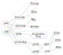

* Vannevar Bush, memex
* triplestore -> trailstore -> subgraph store
* Are there any graph databases which have unnamed edges?

These are some [[notes]] about my journey so far with graphs for knowledge management, and an idea for a new type of, or a particular approach to, graph databases which I call the 'subgraph database'.

I have always been fascinated with knowledge management and the organisation of different artefacts such as songs in my music collection or pages on my websites. From my early days with WordPress I always lamented the distinction between 'categories' and 'tags' and the purposeful splitting of capabilities across two different features or tools, in place of a single unified approach.

At their most basic, tag systems can be modelled as a bipartite graph. All vertices in the graph are either the 'objects' of interest, such as entries in a blog; or 'tags', which are text labels which can be associated with the objects. Objects and tags for a many-to-many relationship and objects are associated to each other through the tags, rather than directly. Usually tags cannot be associated to each other or structured in any way, although more complex taxonomic or categoric systems allow the tags to be assembled into a hierarchy, such that if an object has a tag which itself has a parent tag, then that object is transitively tagged with that parent tag as well.

I used to make heavy use of del.icio.us[^del.icio.us] many years ago and I was fascinated by the idea of 'folksonomy': an organically evolving, user constructed classification system. As far as I remember, del.icio.us' tag system was flat, and tags could not be associated with each other. However, I did wonder what the site would look like if users could construct their own tag hierarchies and share these with other people. For example, I may tag some links with 'cooking' and 'cheese' and assemble these under a super-tag 'food'. I could then publish my taxonomy and other people could then explore their own links and tags through this hierarchy.

A couple of years ago I discovered the zettelkasten system of note-taking and I adore it. I would summarise the two key properties of a zettelkasten as short notes, and links. I have yet to dive deeper into the short notes aspect, but the emphasis on links as the primary organisation system has been revolutionary for me. Links subsume both tags and directories in their entirety, because arbitrary linking is much more generic than these other systems. If I want to tag some articles as 'food', I can just create a 'food' page and then link to this 'tag-page' from the other pages. This is exactly how I organise my website jpreston.xyz, using a set of pages which can freely link to each other, and then creating some empty pages to serve as categories or tags. This allows me to organise pages and tags hierarchically and to break out of the hierarchy and link between pages when necessary.

I use Zotero for handling my growing collection of bookmarks, and I freely combine academic and non-academic material because I do not worry about traversing this network of resources as I can lean on a tag system and a search system which also looks inside abstracts. Zotero suffers from the same problem as WordPress, with a mix of a hierarchical 'collections' system and a flat 'tags' system. I previously organised my Zotero library using a hierarchy of collections but I found this frustrating to use when I wanted to add something from my browser (via the browser extension) to multiple collections. Now I use tags, but because I can't build a hierarchy of tags I have a hit-and-miss approach to tagging items with a list of tags like 'policy, public policy, public health policy, public health': I don't always tag every item with all relevant tags because I can't remember them all! Fortunately I don't think this has caused too much pain so far. Zotero does support 'relating' items to each other, so I could hack together a zettelkasten-inspired link structuring approach but I worry how this will interact with other features like search, so for now I am sticking with tags.

On the desktop, files are largely bound to the hierarchical system of the directory structure, which permits a file to live in only a single leaf category. Symbolic links can be used to break out of this and effectively place a file in multiple directories. There are tag-based overlays on the filesystem such as TMSU[^tmsu] and file indexing systems to allow search for files by metadata or contents. However I have again found that the restrictive hierarchy isn't too painful, as I have managed to develop a good hierarchy to position the groups of files I work with most often.

Despite the lack of pain with current approaches, I can't help but wonder what myself and other computer users might be missing with a more flexible system, and what the world (or at least our relationships with computers, data, and knowledge) would look like if link-based or zettelkasten-like approaches were more common. My friend Dale has a philosophy that users of products can become ignorant to the limitations of those products and we don't always know how much better our situation could be until we've tried something new or different. This was very much the case for myself with true wireless earbuds. I was quite happy with my regular wired in-ear headphones, even though I would get some cable noise, and even though it would take a minute or so to thread the cable down my jacket so I wasn't worried about catching the cable on anything. In the context of the wired headphones themselves, these were just minor inconveniences, but when I got some true wireless earbuds and tried them, this completely recontextualised those issues. Suddenly, it felt so much easier and more convenient to use my headphones when I didn't have to deal with a cable, even if this only saved me a few seconds per day, and as a result I make much more use of the wireless headphones than I ever did with the wired ones.

In addition to my website I make heavy use of link-based organisation for my PhD research, where I use a Foam workspace[^foam] to organise and connect my notes. With research it is necessary to make use of many different types of data and document, and I wonder how links can be overlaid on top of different resources. An initial idea would be a tool like TMSU which allows linking from one file to another via an overlay database, but I think the real benefit would come from a content-aware link overlay system. In Foam, links are embedded in Markdown documents, such that I can write a sentence like `Potatoes are a kind of <<vegetable>>`[^square-brackets], and the bracketed word is interpreted as a reference to a 'vegetable' file, which links these two files together. Because the link is embedded directly in the document from which it originates, it contextualises the link, and promotes the creation of links as part of the natural writing process. This approach is referred to as wikilinks[^wikilinks]. Foam even allows linking to particular sections of a target Markdown document[^foam-section-link], which with sufficiently small sections or files (i.e. embracing the zettelkasten approach) results in links which are contextualised at both ends. I wonder if this linking mechanism could be moved into an overlay system like TMSU, and made to support different file types. For example, could I select a paragraph of text in a PDF, and then link this to a particular area of an image file? This could allow me to associate research papers to an interactive map of the world based on the geographic origin of their datasets; or link facts from a biology textbook to a diagram of a cell.

A variety of data models exist for graph databases, and at the time of writing the two most popular approaches are the 'property graph' and the 'RDF graph'. With a property graph, vertices and edges possess a dictionary or map which allows associating key-value pairs to store metadata. An RDF graph does not include vertex and edge dictionaries. Both models require an edge to have a single 'label', and for an RDF graph this must be a URI. Both models are also directed. There is a considerable set of extra properties which graphs may have including multiplicity of edges (multigraphs), undirectedness, hyperedges and hypervertices (hypergraphs and metagraphs), and so I have always been curious if there is a sufficiently generic graph model from which all other types of graphs can be implemented. I believe the answer to this lies in the way in which multiple graphs can be composed to create a larger graph, which brings me to 'reified supergraphs'.

Mathematically speaking, if some graph B is present inside of another graph A, meaning that A contains a superset of the vertices and edges of B, then B is a subgraph of A, and A is a supergraph of B. I use the term 'reified supergraph' to refer to a graph which is represented as a set of graphs which can be combined together to create a single graph. In other words, a graph is a pair of sets $$(V, E)$$ such that $$E : V \to V$$, and a reified supergraph is a set of graphs $$\{ (V_i, E_i) \mid (V_i, E_i) \text{ is a graph} \}$$ which can be unified into a single graph $$( \bigcup V_i , \bigcup E_i )$$. The reified supergraph goes further than this by treating the set of subgraphs as an additional set of vertices, such that the complete unified representation of a reified supergraph $$G$$ is $$( G \cup \bigcup V_i, \bigcup E_i )$$, with the subgraphs reified within the completed supergraph as their own vertices. For example, we can combine this subgraph:

[{:style="max-width: 250px"}](assets/img/reified_supergraphs_1.svg)

and this subgraph:

[{:style="max-width: 300px"}](assets/img/reified_supergraphs_2.svg)

to create this reified supergraph:

It is also possible to draw edges between the reified vertices to allow modelling of arbitrarily complex hierarchical data:

What is unique about a reified supergraph is the constraint that all subgraphs are represented as their own hypervertices, and thus that no edge can appear outside of a surrounding hypervertex. The reified supergraph therefore partitions itself into a smaller set of graphs which are by themselves meaningful, and demonstrates how the history of the construction of a graph can be stored within itself.

I don't like the property graph model because it inflates the underlying graph model with per-vertex and per-edge key-value stores, which are superfluous because these are themselves just more graphs. If the graph model includes labelled edges, it is simple to remove the properties from the vertices and store these as additional vertices along specific labelled edges. However, how are we supposed to abstract edge properties into the underlying graph, if an edge cannot have other edges associated with it? Further, what do we do if we have no labelled edges? It is possible to eliminate both labelled edges and edge properties using a reified supergraph, because the reification of subgraphs allows us to isolate the the relation, the vertex properties, and the edge properties, as distinct and semantically relevant subsets of the graph.

For example, here is a typical property graph representation of some UK Prime Ministers:

[{:style="max-width: 300px"}](assets/img/reified_supergraphs_5.svg)

This can be broken down into a set of subgraphs in a number of different ways. One option is to represent first each vertex with its attributes, and then each edge. However, we may want to consider the party affiliation as an attribute and include that in our first step; or we may want to associate the Prime Ministers and their premierships within a single subgraph. We can of course include additional subgraphs which include no new vertices or edges, and importantly this does not make these subgraphs redundant, rather each of the subgraphs which are explicitly included in a reified supergraph exists to tell its own story about the overall supergraph, drawing attention to some data over others.

Here is a potential representation of the preceding property graph of Prime Ministers as a reified supergraph:

Now each labelled edge is itself represented as a vertex to capture the label, with the relation passing through this vertex. Because properties are now also represented as unique vertices, it is no longer possible from graph to determine the names of each Prime Minister, without reference to the reified subgraph hypervertices. This reified supergraph is composed of five subgraphs, and their corresponding hypervertices have been colour coded. We could read this reified supergraph as the combination of the statements "pm1 has first-name Theresa and last-name May" (red); "pm2 has first-name Boris and last-name Johnson" (green); "pm1 and pm2 are both members of the Conservative Party" (blue); "pm1's premiership began in 2016 and ended in 2019" (yellow); and "pm2's premiership began in 2019 and is ongoing (NULL end)" (teal).

### References

* <https://fsgeek.ca/category/file-systems/graph-file-systems/>
* <https://opencypher.org/references/>
* <https://www.deepamehta.de/en>

[^del.icio.us]: A snapshot is available at the Internet Archive at <https://web.archive.org/web/20080731101324/http://del.icio.us/>.
[^tmsu]: <https://tmsu.org/>
[^foam]: <https://foambubble.github.io/foam/>
[^square-brackets]: Foam defaults to parsing double square brackets as wikilinks, and I have used the same syntax for this website. Due to limitations in my own code for parsing out wikilinks I cannot write an example with square brackets or it will get parsed as an actual link! Therefore in these examples I use double angle brackets as an alternative.
[^wikilinks]: <https://en.wikipedia.org/wiki/Hyperlink#Wikis>
[^foam-section-link]: <https://foambubble.github.io/foam/wikilinks#support-for-sections>

