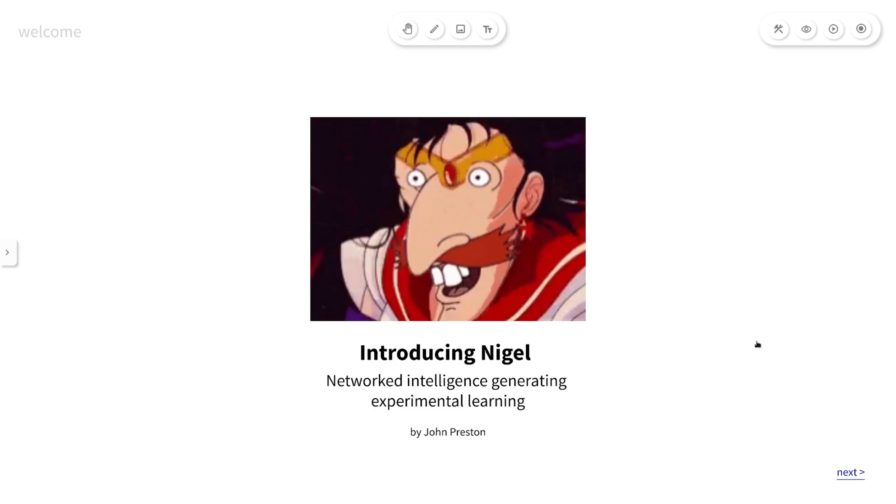
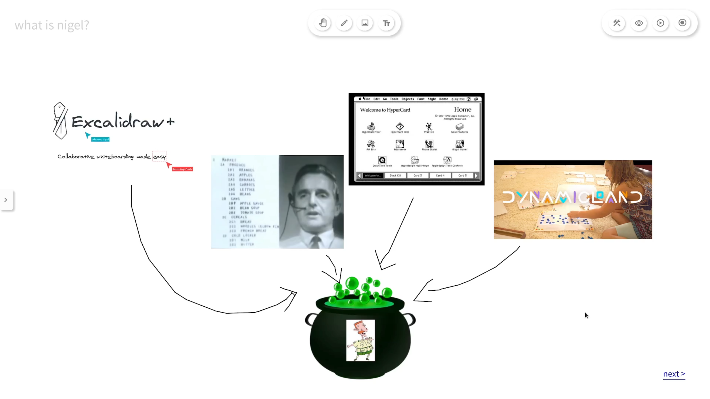
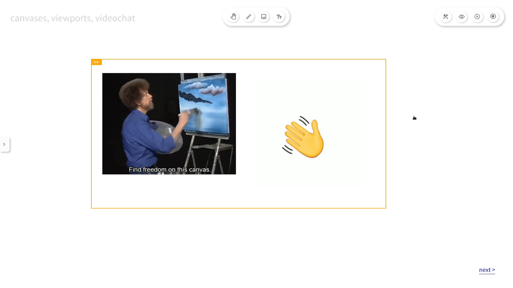
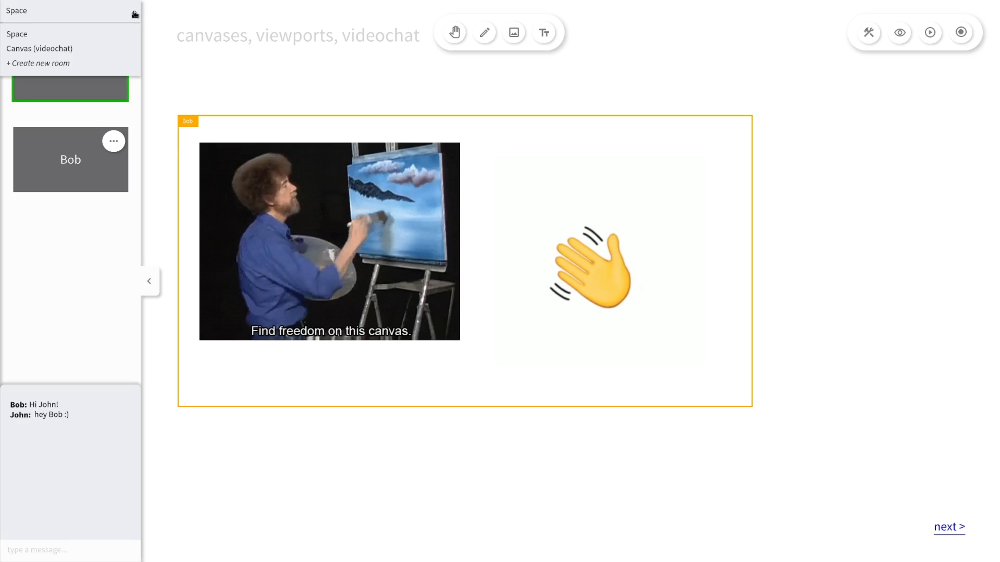
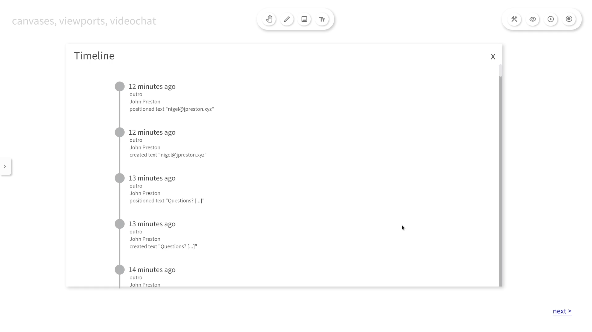
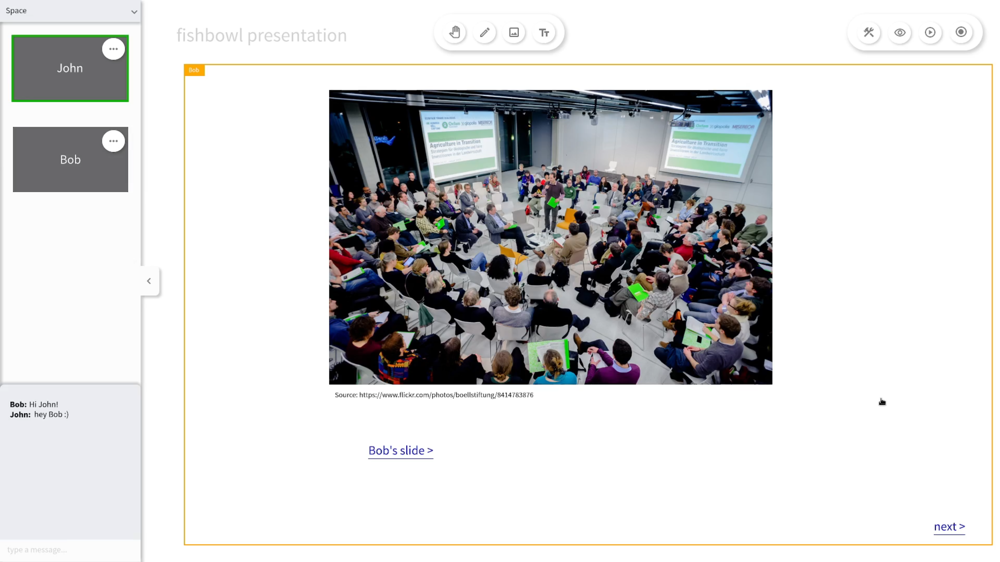
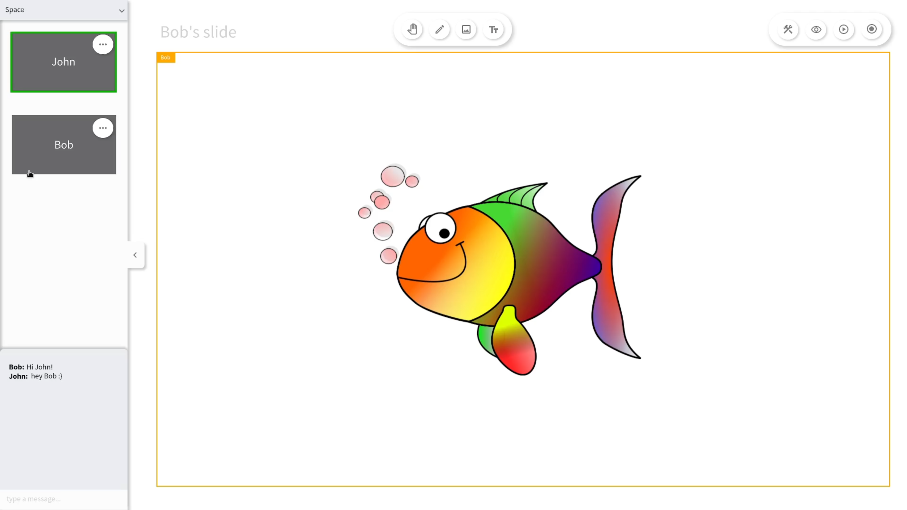
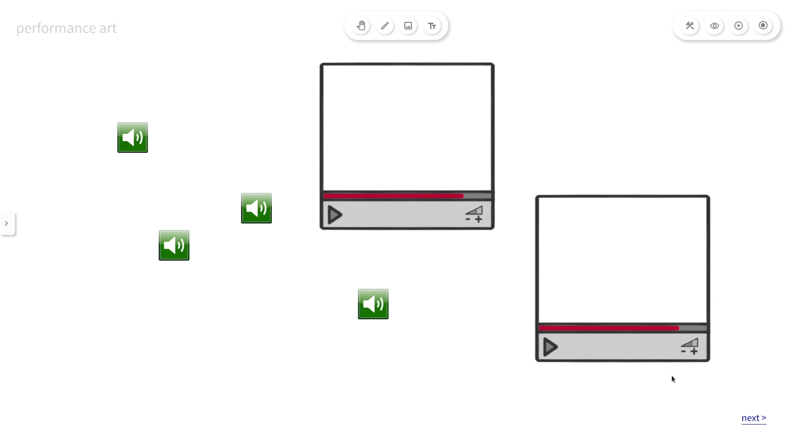
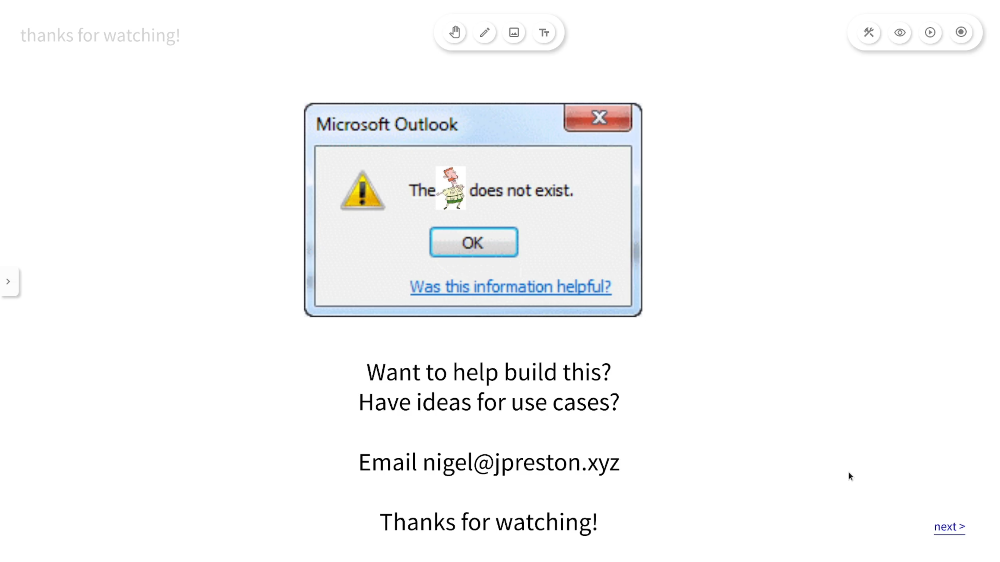

This short presentation / essay describes a novel hypermedia / artistic software invention. You can watch the video here (locally hosted) or [on YouTube](https://www.youtube.com/watch?v=0Q3T_oqrBjk), and there is a transcript with screenshots below.

<video controls>
  <source src="assets/video/introducing_nigel.mp4" type="video/mp4">
</video>

----

Hi, my name is John and in this video I'm going to introduce you to Nigel, a software platform for creating new forms of participatory multimedia. In particular, Nigel is oriented towards novel experimental artistic, research, and educational practices which focus on collaboration and participation, while blurring the lines between live media like events and on demand media such as Web pages.

At it's heart, Nigel draws inspiration from virtual whiteboard tools such as Excalidraw and Miro, hypertext systems such as Doug Engelbart's oNLine System and Bill Atkinson's HyperCard, and Bret Victor's Dynamicland, a communal reimagining of computing environments.

A Nigel _space_ is composed of _canvases_.

Each canvas is an infinite, zoomable, two-dimensional area in which users can draw and arrange text, images, videos, and other objects. Canvases can also contain _links_ to other canvases or Nigel spaces, which allows users to arrange content in a multi-dimensional environment, not limited by the 2D confines of a single canvas. Therefore Nigel is a hypermedia system.

Multiple users can be present in a Nigel space at the same time, and user presence is indicated by _viewports_ which show the current locations of other users and what they can see. Each user can move around the space independently and make their own changes to the space.

To facilitate collaboration between users, Nigel incorporates videoconferencing and chat features.

Nigel's videochat system supports multiple _channels_, so that it is possible to speak to all users, only users in the current canvas, or some specific subset of users in the space, which makes it easy to collaborate in real-time as small groups within a space populated with a large number of other people.

Nigel includes _hand raising_ and _following_ functions, so that it's possible for one person to present media to an audience of other people within a single videochat channel. As the presenter moves around the space, audience members' viewports will move and zoom to follow them so that they can see exactly what the presenter can see. At any time, audience members can raise their hand to request the presenter role. This makes it possible for one person to be presenting while another is editing another area of the space, and then switch seamlessly so that audience member viewports move immediately to this new area of the space.

If a Nigel space is a kind of knowledge object, and videochat provides a knowledge process on top of this object through real-time conferencing, then _recording and playback_ close the loop and allow users to move fluidly between object-mediated and process-mediated knowledge processes, or equivalently, between asynchronous and synchronous modes of interaction.

Much like a wiki, Nigel records all users' edits to the entire space, creating a _timeline_ of changes for every canvas. Additionally, users can opt in to allowing their videochat participation to be recorded, and this is synchronised to the same timeline as the edit history. Unlike typical videoconferencing platforms which record a session from the perspective of a presenter or an audience member, Nigel records edits and videochats from the perspectives of all participating users at the same time. This makes it is possible to step back in time and watch people participating in a Nigel space from each user's own perspective, and viewers can move freely around this recording of the space and videochat channels independently.

Further, because Nigel records the space itself, it is possible to restore objects, canvases, and even the entire space, allowing users to bring objects 'back from the past', or to revert destructive changes to a canvas, just like with a traditional wiki.

Let's go through some example of how you might use Nigel. You've already seen that Nigel can be used to create slide-based presentations like this introduction. However, with Nigel you can go much further, and create new forms of participatory presentations, inspired by unconference methods like fishbowls.

Once you have constructed an initial set of slides, you could schedule a live event and invite participants to log on to the space at the same time. You could then deliver the introduction live and allow participants to engage in real-time.

Other participants will be able to create their own set of canvases and create their own slides for the presentation.

Your fellow participants can raise their hands when they have something to say and audience viewports will move immediately to the new presenter's slides. This allows you to replicate a fishbowl conversation but with the added benefit of whiteboard tools.

With the recording feature, it's possible for participants to create their slides independently on their own time, and record short mini-presentations. Participants can then take a live fishbowl event, break it apart, and spread it over an entire week.

You could therefore host a live 'launch' event for the unpresentation, after which people could add contributions immediately and in real-time, followed by asynchronous contributions over a few days, and then conclude with a final live event at the end of the week which includes a mixture of pre-recorded and live content!

A second use case for Nigel is performance art. Participants can use a canvas as an area to position video and audio elements which can be triggered as part of a live orchestrated performance, which will then be recorded for others to see later.

Third, Nigel can also be used as an alternative to Slack and Discord as a place to host a community. Members can converse and interact in real time through videochat but they can also collect and curate multimedia resources from across the Web, play games, and create new knowledge and artistic objects.

Although this presentation appears to have been built in Nigel, it is actually just a prototype, and unfortunately Nigel doesn't exist yet. I created this video to demonstrate some of the possibilities of such a tool, and to connect with other people who are interested in helping me build this. If you have any feedback on the ideas presented in this video, a use case for a tool like Nigel, or would like to help with designing and building such a platform, please email me. Thanks for watching!

